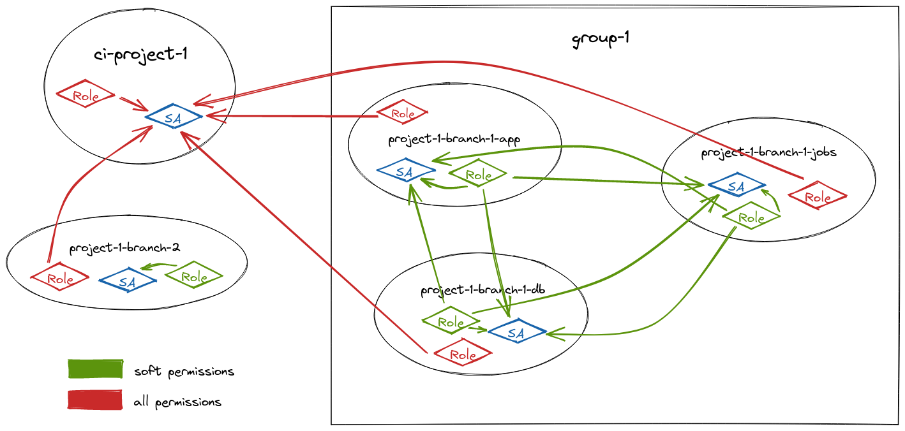

# nsplease

Service Kubernetes pour assigner dynamiquement des Namespaces à des projets par des droits RBAC.

- [Principe](#principe)
  - [Point d'entrée RBAC (petite contextualisation)](#point-dentrée-rbac-petite-contextualisation)
  - [Namespace](#namespace)
  - [Namespace group](#namespace-group)
- [Demande d'un namespace seul](#demande-dun-namespace-seul)
- [Demande d'un namespace dans un groupe](#demande-dun-namespace-dans-un-groupe)
- [Échec de la procédure](#échec-de-la-procédure)

## Principe

Chaque projet a un Namespace de CI depuis lequel les pipelines de CI/CD sont exécutés.

### Point d'entrée RBAC (petite contextualisation)

En amont de `nsplease`, un `utilisateur` (ou un workflow) est membre d'un `projet`.

L'appartenance d'un `utilisateur` à un `projet` est garantie soit par `nsplease`, soit par Rancher (soit les deux).

Lorsque cette appartenance est gérée par `nsplease`, cela est géré directement via les RBAC de Kubernetes et un accès à un Namespace de CI initial détermine l'accès aux Namespaces suivants, depuis l'intérieur même de ce Namespace. Appelons-le `ci-namespace` pour plus de clareté.

La convention de nommage du `ci-namespace` permet d'en déterminer l'accès par un `projet` auquel il correspond.

L'accès initial au `ci-namespace` du projet est accordé par un service tiers de webhook (en l'occurence c'est le webhook de `kontinuous`).

C'est le service de webhook qui garantit l'appartenance à un projet (via un token par exemple, c'est le cas pour celui de `kontinuous`) et qui autorise le déploiement d'un `pipeline` dans le `ci-namespace`.

Le `pipeline` est un Job Kubernetes dont le manifest est prédéfini par le service de webhook, il hérite des droits accordés au ServiceAccount présent dans le Namespace.

### Namespace

Les projets peuvent demander des Namespaces où pourront être définis des ressources Kubernetes, comprenant de Deployments, Jobs, StatefulSets, Secrets, ConfigMaps etc.

Un Namespace de CI doit avoir tous les droits sur tous les Namespaces de son projet et sur lui-même.

### Namespace group

Les namespaces peuvent partager leurs accès avec d'autres Namespaces appartenants au même projet, en utilisant un `namespace-group`.

Un Namespace appartenant à un `namespace-group` doit avoir les droits de lecture sur tous les Namespaces de ce `namespace-group`, dont lui-même.

Le `namespace-group` d'un Namespace est noté dessus grâce à un label.

## Demande d'un namespace seul

Un Namespace `requested-ns` est créé avec le label : `nsplease/project=project-1`.

Opérations à effectuer :

- **droits de lecture sur lui-même** : créer dans `requested-ns` un ServiceAccount, un Role de lecture et un RoleBinding entre les deux
- **tous les droits par le Namespace de CI sur `requested-ns`** : créer dans `requested-ns` un Role à accès complet et un RoleBinding vers le ServiceAccount du Namespace de CI

## Demande d'un namespace dans un groupe

Un Namespace `requested-ns` est créé avec les **labels** :

- `nsplease/project=project-1`
- `nsplease/group=group-1`

Opérations à effectuer :

- **opérations requises pour un namespace seul**
- **droits de lecture par `requested-ns` sur tous les autres Namespaces du groupe** : créer dans chaque autre Namespace un RoleBinding entre son Role de lecture et le ServiceAccount de `requested-ns`
- **droits de lecture par tous les autres Namespaces du groupe sur `requested-ns`** : créer dans `requested-ns` un RoleBinding pour chaque autre Namespace du groupe, entre le Role de `requested-ns` et le ServiceAccount de l'autre namespace

## Échec de la procédure

Si une des deux procédures ci-dessus se déroule avec succès, ajouter une **annotation** `nsplease/state=done` sur `requested-ns`.

Si une des actions de la liste échoue, réessayer l'opération complète plusieurs fois en temporisant. Si la procédure reste en échec, ajouter une **annotation** `nsplease/state=failed` et arrêter.

Si un Namespace est modifié avec l'**annotation** `nsplease/state=retry`, la procédure complète est relancée.
